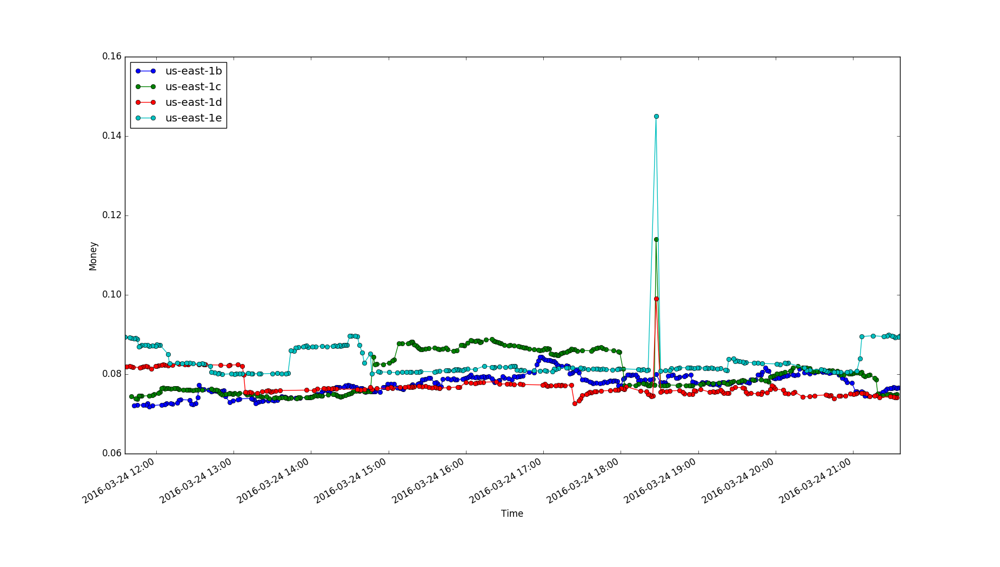

# Spinn

Just an ugly script to mess around with AWS spot instances.

Right now just prints out a plot based on some configuration values.

## Example image

## Issues

Many. :)

The biggest is I'm just getting the last 1000 values.

